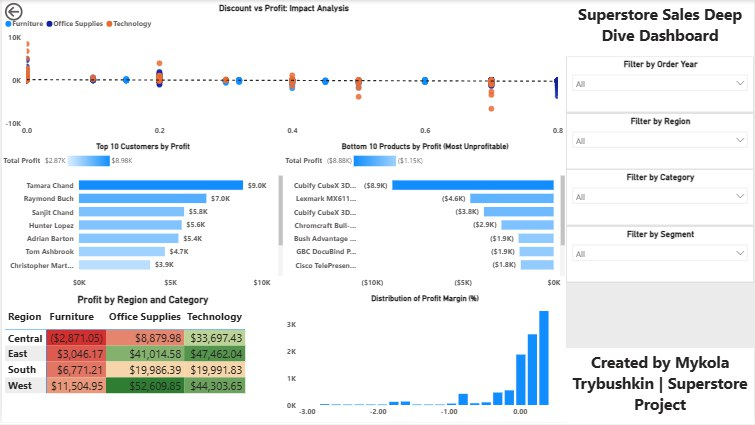

README.md — Superstore Sales Analysis Project
(Full Professional Template)
Superstore Sales Analysis & Power BI Dashboard

A full end-to-end data analytics project using Python (Pandas, Seaborn, Matplotlib) for data cleaning & EDA, and Power BI for interactive dashboarding.

The goal is to analyze sales performance, profitability drivers, customer value, and discount impact using the popular Superstore dataset.

📊 Project Overview

This project demonstrates a complete analytics workflow:

Data Cleaning in Python

Exploratory Data Analysis (EDA) with statistical summaries and 15+ visualizations

Business Insights based on real-world KPIs

Interactive Dashboard built in Power BI

Final Results packaged in a clear and structured GitHub repository

This project is designed as a portfolio showcase of practical analytics skills.

🗂️ Dataset

Source: “Sample Superstore” dataset (Kaggle)

Rows: ~10,000 orders

Period: 2014–2017

Columns include:

Sales, Profit, Discount, Quantity

Category, Sub-Category

Region, State, Segment

Order/Ship Dates

After cleaning, additional fields were added:

Profit Margin

Order Month

Order Year

Order Month Year (for time series)

Shipping Delay (days)

🛠️ Tools Used
Python Stack

Pandas

NumPy

Matplotlib

Seaborn

Jupyter Notebook

BI / Visualization

Power BI Desktop

DAX measures:

Total Sales

Total Profit

Total Orders

Total Quantity

Profit Margin %

Average Discount %

AOV

📁 Project Structure
superstore-sales-analysis/
│
├── data/
│   ├── Sample - Superstore.csv
│   └── superstore_clean.csv
│
├── notebooks/
│   └── superstore_analysis.ipynb
│
├── dashboard/
│   ├── superstore_dashboard.pbix
│   └── screenshots/
│       ├── overview_full.png
│       ├── overview_kpis.png
│       ├── overview_profit_by_category.png
│       ├── deepdive_scatter_discount_profit.png
│       └── ...
│
├── outputs/
│   └── state_performance.csv
│
└── README.md

This structure mirrors a real professional analytics project.

🔍 Exploratory Data Analysis (Python)

The EDA covered:

Sales and profit by category, sub-category, region

Time series trends (monthly sales and profits)

Discount impact on profitability

Customer performance (Top 10 by profit)

Worst performing products

Geographic patterns

Shipping delay insights

The notebook includes:

12–18 visuals

GroupBy tables

Business commentary under each section

📈 Power BI Dashboard
Page 1 — Overview

Includes:

KPI Cards (Total Sales, Total Profit, Profit Margin %, Total Orders)

Profit by Category (bar chart)

Sales by Sub-Category

Monthly Sales trend (line)

Total Sales / Profit, Profit Margin % by States (map)

Interactive filters: Year, Category, Region

Page 2 — Deep Dive

Includes:

Discount vs Profit scatterplot (with trendline)

Top 10 Customers by Profit

Bottom 10 Products by Profit (Most Unprofitable)

Profit Margin distribution (histogram)

Region × Category Profit Matrix (heatmap)

Filters: Year, Region, Category, Segment

🧠 Key Business Insights

Technology category drives the majority of profit, while Furniture contains several loss-making products, mainly due to discounting.

Discounts above 20–30% consistently cause negative profit, making discounting the primary source of profit erosion.

Top customers contribute disproportionately to total profit, following a strong Pareto (80/20) pattern.

Central region underperforms, showing the highest concentration of unprofitable sales, while West and East regions lead in profitability.

Bottom 10 products generate significant losses, especially in Furniture and discounted items, requiring immediate pricing or catalog review.

Profit margins are heavily skewed, with many orders operating at low or negative margins, indicating opportunities for pricing strategy improvement.

📸 Dashboard Screenshots
Overview Page

Deep Dive Page

(Additional screenshots available in /dashboard/screenshots/)

📘 How to Use This Repository

Open the Jupyter notebook for step-by-step data cleaning & EDA

Open the Power BI file (.pbix) to explore interactive visuals

Review screenshots in the dashboard folder

Read the insights summary in this README

This structure makes it easy for hiring managers to browse and evaluate the project.

📌 What I Learned

Building production-grade EDA workflows

Working with date features and time series

Creating DAX measures for business KPIs

Designing professional Power BI dashboards

Extracting actionable business insights

Presenting results clearly for non-technical audience

🏁 Final Deliverables

Cleaned dataset: superstore_clean.csv

Python notebook: superstore_analysis.ipynb

Interactive Power BI dashboard: superstore_dashboard.pbix

Screenshot gallery

README.md summary

👤 Author

Mykola Trybushkin
Data Analyst / Business Intelligence / Python Analytics
GitHub: https://github.com/kolyatri
LinkedIn: https://www.linkedin.com/in/mykola-trybushkin-217a44117/